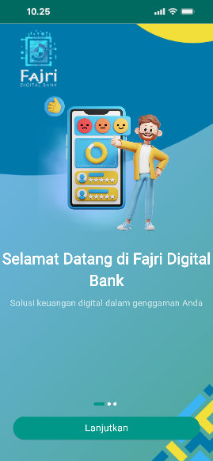
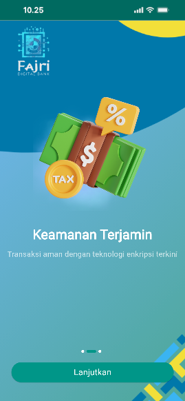
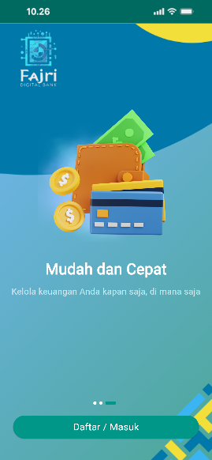
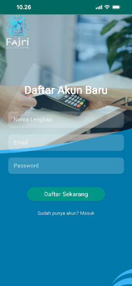

# Fajri Digital Bank

Nama: Fajri Khaerullah
NIM: 1123150166

## Langkah-langkah Pengembangan

### Langkah 1: Membuat proyek Flutter bernama fajri_digital_bank dan menambahkan repository GitHub.

### Langkah 2: Membuat file main.dart dengan konfigurasi Material 3, warna tema teal, dan menghapus debug banner.

### Langkah 3: Mengimplementasikan Splash Screen multi-halaman dengan gambar PNG, navigasi geser, dan tombol dinamis.

### Langkah 4: Membuat halaman Sign Up dengan form pendaftaran (hanya tampilan) dan tombol “Daftar Sekarang”.

### Langkah 5: Membuat halaman Sign In dengan form login (hanya tampilan) dan navigasi ke halaman Sign Up.

### Langkah 6: Membuat halaman OTP dengan input 6 digit (hanya tampilan) dan tombol Verifikasi.

### Langkah 7: Membuat halaman Home setelah login berhasil (hanya tampilan) dengan tombol keluar.

### Langkah 8: Menambahkan screenshot hasil aplikasi ke README.

### Langkah 9: Memperbaiki error duplikasi deklarasi fungsi `_startCountdown` di OTP Screen.

### Langkah 10: Menghapus halaman OTP dan menyesuaikan navigasi setelah Sign In langsung ke Home Screen.

### Langkah 11: Memperbaiki error 'Unable to load asset' dengan mengaktifkan deklarasi assets di `pubspec.yaml`.

### Langkah 12: Menyesuaikan posisi form login di halaman Sign In agar lebih ke bawah.

## Hasil Screenshot
* 
* 
* 
* 
* 
* 

## Catatan Akhir

Semua langkah pengembangan kode telah selesai. Untuk menyelesaikan proyek ini sepenuhnya, mohon lakukan hal berikut:

1.  **Perbaiki Masalah Lingkungan Flutter:** Pastikan semua masalah yang dilaporkan oleh `flutter doctor` telah diperbaiki (terutama terkait Android dan Xcode toolchain).
2.  **Sediakan Aset Gambar:** Pastikan file gambar yang diperlukan (`splash_1.png`, `splash_2.png`, `splash_3.png`, dan `background.png`) berada di direktori `assets/images` dengan nama yang benar.
3.  **Jalankan Aplikasi:** Jalankan aplikasi di emulator atau perangkat fisik Anda.
4.  **Ambil Tangkapan Layar:** Ambil tangkapan layar dari setiap halaman yang telah diimplementasikan (Splash, Sign Up, Sign In, Home).
5.  **Perbarui `README.md` dengan Tangkapan Layar Asli:** Ganti placeholder tangkapan layar di bagian "Hasil Screenshot" dengan gambar asli yang telah Anda ambil.